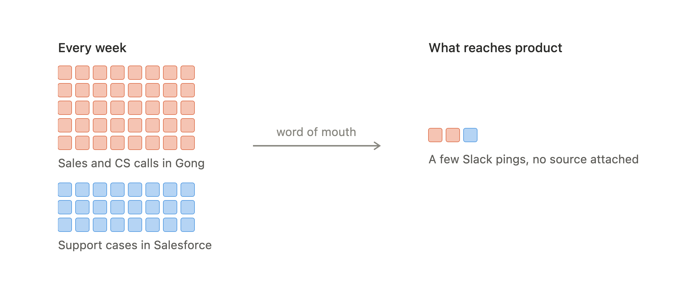
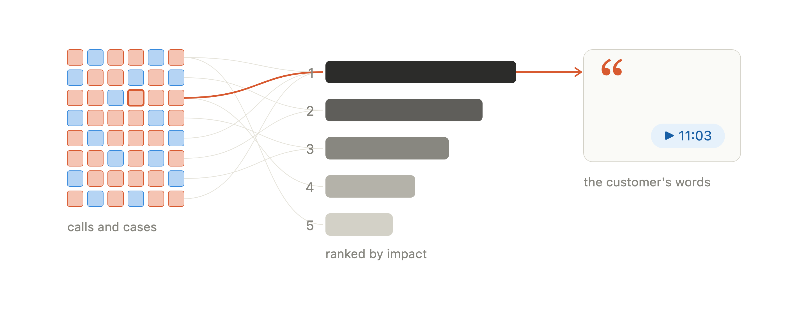
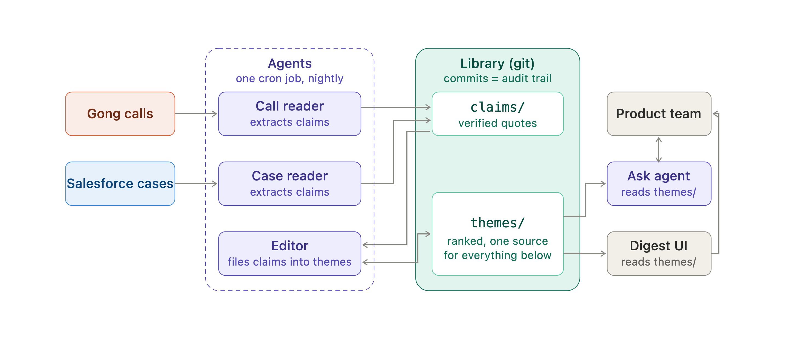
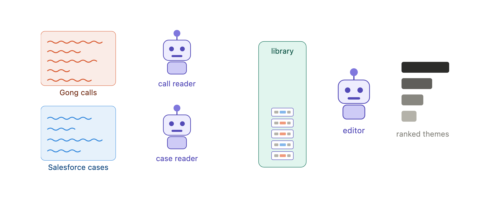
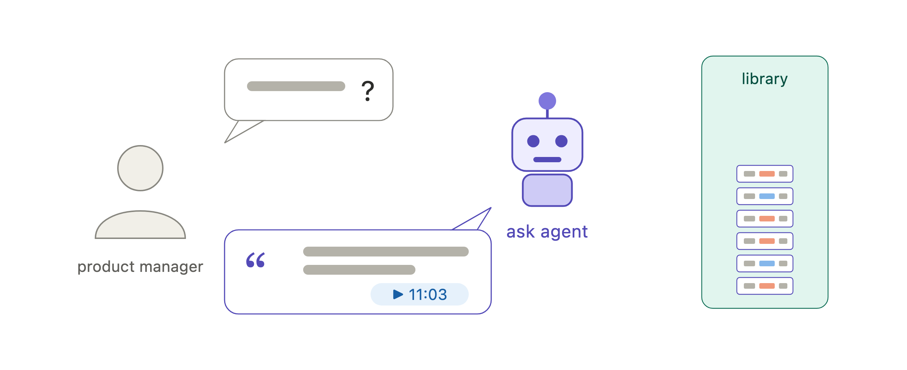
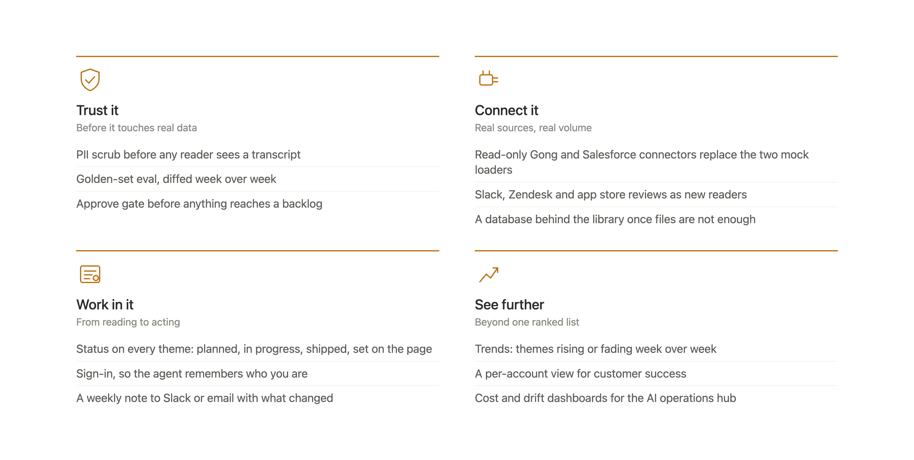

# Feature / Bug Requests

A prototype I built for Momentive Software. Every night it reads the sales calls and support cases, and turns them into one ranked list of what customers are asking for, in their own words.

**Live page:** https://jimit1.github.io/feature-bug-requests/ (the passphrase for the ask panel is in my email)

## How it works

Customers ask for things all week, and only a little of it reaches the product team.



This puts all of it in one place, in the order I would work on it.



The whole thing on one page.



Two agents read the conversations and write down each request. A third one groups the requests into themes and ranks them.



You can also just ask a question, and the answer comes back with the quotes behind it.



Every line can be followed home. Theme THEME-0001 carries the sentence "Every renewal statement we send out is missing the balance that carried over from the previous period, so the invoice total reads far higher than it should.", said on call 7782934451002 at 11:03.

In its first week it ran for about five cents a night, verified 22 claims, and built 10 themes.

## What comes next

Four groups of work, designed but not built.



## Run it yourself

```
pip install -r requirements.txt
export ANTHROPIC_API_KEY=...
python run.py --next
python ask.py "what should we fix first"
```
