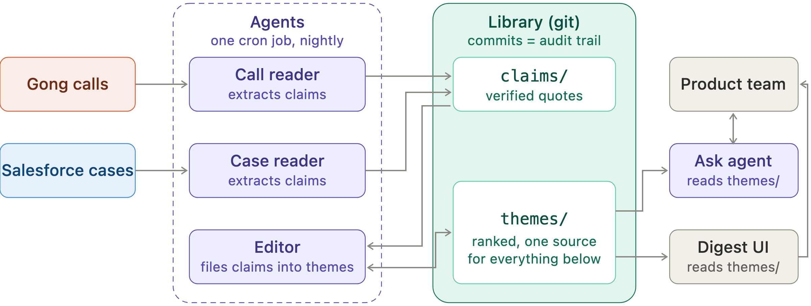

# Feature / Bug Requests

A prioritized digest for a product team, built from the conversations already in Gong (sales and customer success calls) and Salesforce (support cases). Every line traces back to the second in a call or the comment in a case where a customer said it. A scoped prototype for Momentive Software, on mocked data in the real API shapes.

**Live page:** https://jimit1.github.io/feature-bug-requests/ (the passphrase in my email unlocks the ask panel; the digest data itself is a public file, as a prototype should be)



**Every night**, one job (`python run.py --next`, a GitHub Actions schedule here, one cron line in production):

1. Two reader agents, cheap tier, turn each call and case into claims: bug or feature, the customer's exact words, who said it, and where (call id plus turn start, or case and comment id).
2. Code verifies each quote is an exact substring of the cited turn or comment. Failures are recorded with a reason, never patched.
3. The editor agent, frontier tier, reads the theme index first, then every unfiled claim, and appends it to an existing theme or opens one, with one line of why. Code applies the decisions and scores every theme (accounts, value, open cases, recency, bug; the page shows the arithmetic).
4. `library/themes/` is published as `ui/data.js` and the run commits. The commit log is the audit trail; the page and the ask agent both read that published library and nothing else.

**Ask** (`ask.py`, hosted as one Lambda in `hosting/`) answers in a few short sentences from the same library and names the themes it used; the page spotlights them. Passphrase and a daily cap protect the key.

**Traceability:** theme THEME-0001 carries claim `c-915d4dd0bc13`, "Every renewal statement we send out is missing the balance that carried over from the previous period, so the invoice total reads far higher than it should." It cites call 7782934451002, speaker 4521, 663288 ms (11:03 on the page), and that sentence is at exactly that turn in `data/gong/7782934451002.json`.

**In production:** swap the two mock loaders in `run.py` for read-only Gong and Salesforce connectors; nothing else changes. Only days not yet in `library/state.json` are read. Bedrock instead of the API makes sense when data must stay in the company's AWS account, identity should be IAM, or billing should consolidate under AWS; the model call is one function.

**First week on the API path** (from the commit messages): $0.05 per night on average, 22 claims verified, 2 rejected, 10 themes, and after the first night 10 of 12 claims joined an existing theme instead of opening a new one.

**Not built, by choice** (drawn in `deck/png/slide-7.png`): PII scrub before the readers, live connectors, a golden-set eval, and an approve gate before anything reaches a backlog.

```
pip install -r requirements.txt && export ANTHROPIC_API_KEY=...
python run.py --next && python ask.py "what should we fix first" && pytest -q
```
